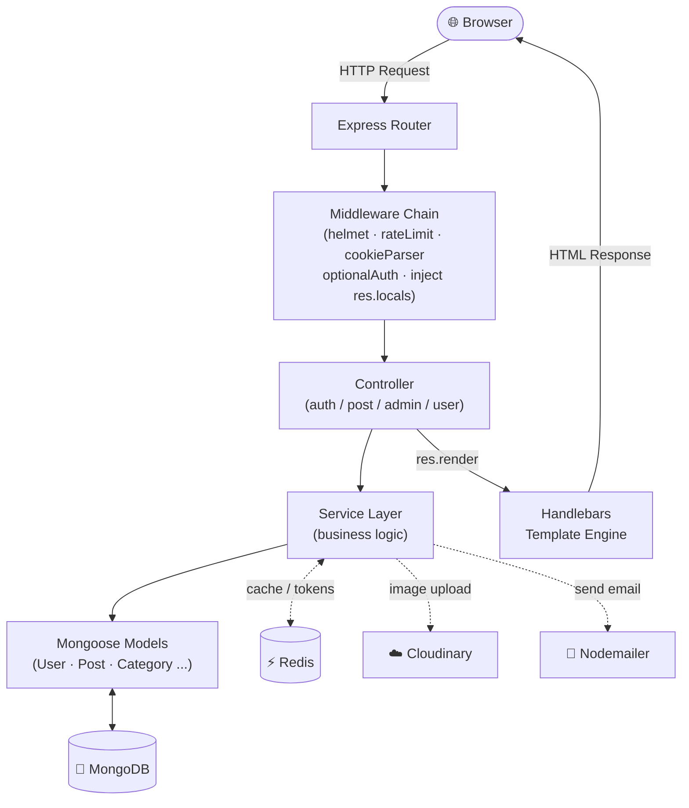
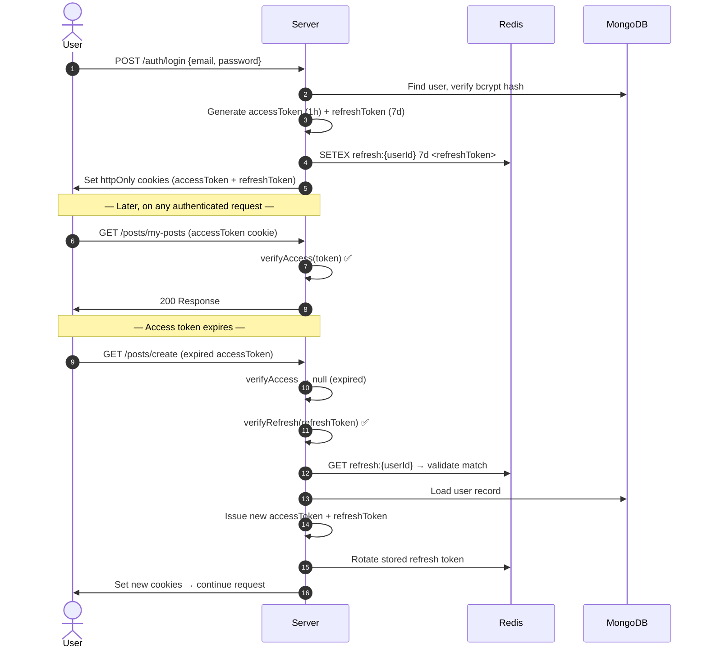
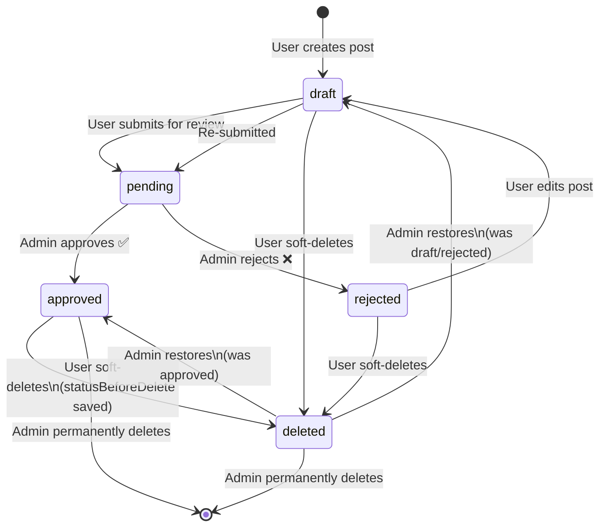
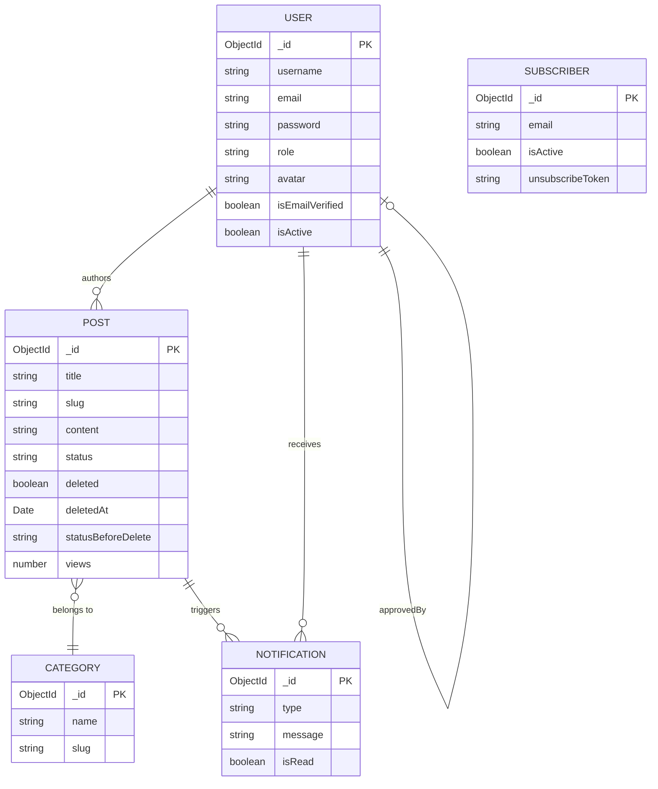

<div align="center">

# ✍️ Blog App

**A production-ready, multi-user blogging platform built with Node.js, Express, and MongoDB.**

[](https://nodejs.org/)
[](https://expressjs.com/)
[](https://mongodb.com/)
[](https://redis.io/)
[](LICENSE)
[](CONTRIBUTING.md)

[Live Demo](https://blog-kubp.onrender.com)
</div>

---

## 📖 Table of Contents

1. [Introduction](#-introduction)
2. [Key Features](#-key-features)
3. [Overall Architecture](#-overall-architecture)
4. [Tech Stack](#-tech-stack)
5. [Installation](#-installation)
6. [Running the Project](#-running-the-project)
7. [Environment Configuration](#-environment-configuration)
8. [Folder Structure](#-folder-structure)
9. [API Reference](#-api-reference)
10. [Contribution Guidelines](#-contribution-guidelines)
11. [License](#-license)

---

## 🌟 Introduction

**Blog App** is a full-stack, server-rendered blogging platform designed for communities and organisations that need editorial control over their published content. Every article submitted by a registered user goes through an admin-approval workflow before it appears publicly — keeping content quality high without sacrificing a smooth authoring experience.

The project follows a classic **Model-View-Controller (MVC)** architecture on top of **Express.js**, uses **MongoDB** as its primary data store, **Redis** for caching and session management, **Cloudinary** for image hosting, and **Nodemailer** for transactional email — all rendered server-side with **Express Handlebars**.

> **Who is this for?**  
> Teams or individuals who want a self-hosted, customisable blog that balances open participation with editorial oversight. The codebase is intentionally structured to be readable and extensible — a solid foundation to build on rather than a black box to configure.

---

## ✨ Key Features

### 👤 User Features
| Feature | Details |
|---|---|
| **Authentication** | Register · Login · Logout with JWT (Access + Refresh token rotation) |
| **Email Verification** | Account activation via tokenised email link (24 h TTL) |
| **Password Management** | Forgot password · Reset via email · Change password |
| **Post Authoring** | Rich-text editor with Bold / Italic / Headings / Lists / Links / Image embed |
| **Draft & Submit** | Save drafts, submit for review, re-edit rejected posts |
| **Post Management** | View all personal posts filtered by status; soft-delete with one click |
| **Profile Page** | Upload / remove avatar (Cloudinary), view post statistics |
| **Account Deletion** | Self-service account removal with password confirmation |
| **Newsletter** | Subscribe to receive email notifications for newly approved posts |
| **Search & Filter** | Full-text keyword search, category filter, tag filter, pagination |
| **Notifications** | In-app notification badge for approval/rejection results |

### 🛡️ Admin Features
| Feature | Details |
|---|---|
| **Dashboard** | Live stats: total posts, pending, approved, deleted, user count |
| **Post Approval** | Approve or reject with a mandatory rejection reason (≥ 10 chars) |
| **Deleted Posts** | Browse user-soft-deleted posts; restore to original status or permanently delete |
| **Category Management** | Create and delete content categories from the dashboard |
| **Email Notifications** | Automatic emails to authors on approval/rejection; newsletter batch to subscribers |

### ⚙️ Platform Features
- **JWT with silent refresh** — access tokens auto-renewed from `httpOnly` refresh-token cookies; no forced logout on expiry
- **Redis caching** — post-list pages cached for 5 minutes; invalidated on any content change
- **Graceful Redis degradation** — application continues to function fully when Redis is unavailable
- **Rate limiting** — global 300 req/15 min; auth endpoints hardened to 20 req/15 min
- **Security headers** — Helmet, `sanitize-html` for XSS prevention, `bcryptjs` (12 rounds)
- **Soft delete with status preservation** — `mongoose-delete` plugin; restoring a post returns it to its exact pre-deletion status

---

## 🏗️ Overall Architecture

### Request / Response Flow



---

### Authentication Flow



---

### Post Lifecycle



---

### Data Model Overview



---

## 🛠️ Tech Stack

| Layer | Technology | Version | Purpose |
|---|---|---|---|
| Runtime | Node.js | ≥ 18.0 | JavaScript server environment |
| Framework | Express.js | 4.18 | HTTP server, routing, middleware |
| Database | MongoDB + Mongoose | 8.0 | Primary data store |
| ODM Plugin | mongoose-delete | latest | Soft-delete with `overrideMethods: 'all'` |
| Cache / Sessions | Redis (ioredis) | 5.3 | Post-list cache, JWT token store |
| Authentication | jsonwebtoken + bcryptjs | 9.0 / 2.4 | JWT RS256, password hashing (12 rounds) |
| View Engine | Express Handlebars | 7.1 | Server-side HTML rendering |
| File Storage | Cloudinary | 1.41 | Avatar and post image hosting |
| File Upload | Multer + multer-storage-cloudinary | 1.4 | Streaming multipart upload |
| Email | Nodemailer + Gmail | 6.9 | Transactional & newsletter email |
| Security | Helmet + sanitize-html | latest | HTTP headers, HTML sanitisation |
| Rate Limiting | express-rate-limit | 7.1 | Abuse prevention |
| Slug Generation | mongoose-slug-updater | latest | Auto URL-friendly slugs from title |
| Compression | compression | 1.7 | Gzip HTTP responses |

---

## 🚀 Installation

### Prerequisites

Ensure the following are installed on your machine:

| Requirement | Minimum Version | Check |
|---|---|---|
| Node.js | 18.0.0 | `node -v` |
| npm | 9.0.0 | `npm -v` |
| MongoDB | 6.0 (or Atlas) | `mongod --version` |
| Redis | 7.0 (or Upstash) | `redis-server --version` |

> **Tip — Cloud services (free tiers):**  
> [MongoDB Atlas](https://mongodb.com/atlas) · [Upstash Redis](https://upstash.com) · [Cloudinary](https://cloudinary.com) · [Railway](https://railway.app)

---

### Step-by-step Setup

**1. Clone the repository**
```bash
git clone https://github.com/your-username/blog-app.git
cd blog-app
```

**2. Install dependencies**
```bash
npm install
```

**3. Configure environment variables**
```bash
cp .env.example .env
# Open .env and fill in all required values (see Environment Configuration below)
```

**4. Seed the database** *(creates default admin account + sample categories)*
```bash
npm run seed
```

Default admin credentials created by the seed script:
```
Email:    admin@blog.com
Password: Admin@123456
```
> ⚠️ **Change the admin password immediately after first login in production.**

---

## ▶️ Running the Project

### Development
Hot-reload via `nodemon`:
```bash
npm run dev
```
Server starts at **http://localhost:3000**

### Production
```bash
NODE_ENV=production npm start
```

### Docker
```bash
# Build image
docker build -t blog-app .

# Run container
docker run -p 3000:3000 --env-file .env blog-app
```

### Docker Compose *(with MongoDB + Redis)*
```yaml
# docker-compose.yml
# ============================================================
#  Blog App — Docker Compose
#  Brings up the full stack locally:
#    app  → Node.js server  (port 3000)
#    mongo → MongoDB 7      (port 27017)
#    redis → Redis 7        (port 6379)
# ============================================================

version: "3.9"

services:
  # ── Application ──────────────────────────────────────────
  app:
    build:
      context: .
      dockerfile: Dockerfile
      target: production       # Use the production stage
    container_name: blog-app
    restart: unless-stopped
    ports:
      - "3000:3000"
    env_file:
      - .env                   # All variables from your .env file
    environment:
      # Override the DB/Redis URLs to use the container hostnames
      MONGODB_URI: mongodb://mongo:27017/blog-app
      REDIS_URL: redis://redis:6379
      NODE_ENV: production
    depends_on:
      mongo:
        condition: service_healthy
      redis:
        condition: service_healthy
    networks:
      - blog-network
    # Graceful shutdown — give Node.js 15 s to finish in-flight requests
    stop_grace_period: 15s

  # ── MongoDB ───────────────────────────────────────────────
  mongo:
    image: mongo:7-jammy
    container_name: blog-mongo
    restart: unless-stopped
    ports:
      - "27017:27017"          # Remove this line in production
    volumes:
      - mongo_data:/data/db
    networks:
      - blog-network
    healthcheck:
      test: ["CMD", "mongosh", "--eval", "db.adminCommand('ping')"]
      interval: 10s
      timeout: 5s
      retries: 5
      start_period: 20s

  # ── Redis ─────────────────────────────────────────────────
  redis:
    image: redis:7-alpine
    container_name: blog-redis
    restart: unless-stopped
    ports:
      - "6379:6379"            # Remove this line in production
    volumes:
      - redis_data:/data
    # Persist data to disk (AOF mode)
    command: redis-server --appendonly yes
    networks:
      - blog-network
    healthcheck:
      test: ["CMD", "redis-cli", "ping"]
      interval: 10s
      timeout: 3s
      retries: 5

# ── Volumes ───────────────────────────────────────────────────
volumes:
  mongo_data:
    driver: local
  redis_data:
    driver: local

# ── Network ───────────────────────────────────────────────────
networks:
  blog-network:
    driver: bridge
```
```bash
docker compose up -d
```

---

## 🔧 Environment Configuration

Create a `.env` file in the project root. All variables are required unless marked *(optional)*.

```bash
# ─── App ─────────────────────────────────────────────────────
NODE_ENV=development            # development | production
PORT=3000
APP_URL=http://localhost:3000   # Public URL — used in email links

# ─── MongoDB ─────────────────────────────────────────────────
MONGODB_URI=mongodb+srv://<user>:<password>@cluster.mongodb.net/blog-app

# ─── JWT ─────────────────────────────────────────────────────
# Generate with: node -e "console.log(require('crypto').randomBytes(64).toString('hex'))"
JWT_ACCESS_SECRET=<min-32-char-random-string>
JWT_REFRESH_SECRET=<min-32-char-random-string-different-from-above>

# ─── Redis ───────────────────────────────────────────────────
REDIS_URL=redis://localhost:6379
# Upstash example: rediss://:password@host:port

# ─── Cloudinary ──────────────────────────────────────────────
CLOUDINARY_CLOUD_NAME=your_cloud_name
CLOUDINARY_API_KEY=your_api_key
CLOUDINARY_API_SECRET=your_api_secret

# ─── Gmail (Nodemailer) ──────────────────────────────────────
GMAIL_USER=your-email@gmail.com
# App Password — create at: myaccount.google.com/apppasswords
GMAIL_APP_PASSWORD=xxxx xxxx xxxx xxxx
```

> **Security note:** Never commit `.env` to version control. The `.gitignore` already excludes it.

---

## 📁 Folder Structure

```
blog-app/
├── index.js                        # Run server
├── app.js                          # Entry point — Express app bootstrap
├── Dockerfile
├── package.json
├── .env.example
│
└── src/
    ├── config/
    │   ├── database.js              # MongoDB connection
    │   ├── redis.js                 # Redis connection (with graceful fallback)
    │   ├── cloudinary.js            # Cloudinary SDK config
    │   └── mailer.js                # Nodemailer transporter
    │
    ├── models/
    │   ├── User.js                  # Auth fields, bcrypt pre-save hook
    │   ├── Post.js                  # mongoose-delete plugin, slug-updater
    │   ├── Category.js
    │   ├── Notification.js
    │   └── Subscriber.js
    │
    ├── controllers/                 # HTTP layer — thin, delegates to services
    │   ├── auth.controller.js
    │   ├── post.controller.js
    │   ├── admin.controller.js
    │   ├── user.controller.js
    │   ├── category.controller.js
    │   └── subscriber.controller.js
    │
    ├── services/                    # Business logic — the core of the application
    │   ├── auth.service.js          # Register, login, email verify, JWT lifecycle
    │   ├── post.service.js          # CRUD, soft-delete, submit, public feed
    │   ├── admin.service.js         # Approve, reject, restore, permanent delete
    │   ├── user.service.js          # Avatar management, account deletion
    │   ├── mail.service.js          # All transactional + newsletter email
    │   ├── redis.service.js         # Cache, token store, rate limiting
    │   └── upload.service.js        # Multer + Cloudinary configuration
    │
    ├── middlewares/
    │   ├── auth.middleware.js       # authenticate, optionalAuth, authorize(role)
    │   ├── validate.middleware.js   # Server-side input validation
    │   ├── cache.middleware.js      # Redis post-list cache (GET only)
    │   ├── upload.middleware.js     # Re-exports Multer configurations
    │   └── error.middleware.js      # Centralised error handler
    │
    ├── routes/
    │   ├── index.js                 # Route aggregator + res.locals injection
    │   ├── auth.routes.js           # /auth/*
    │   ├── post.routes.js           # /posts/*
    │   ├── admin.routes.js          # /admin/* (admin role required)
    │   ├── user.routes.js           # /user/* (authenticated)
    │   ├── subscriber.routes.js     # /subscribe, /unsubscribe
    │   └── home.routes.js           # / → redirect to /posts
    │
    ├── views/                       # Handlebars templates
    │   ├── layouts/
    │   │   ├── main.hbs             # Public layout
    │   │   └── admin.hbs            # Admin panel layout
    │   ├── partials/
    │   │   ├── navbar.hbs
    │   │   ├── footer.hbs
    │   │   ├── pagination.hbs
    │   │   ├── post-card.hbs
    │   │   └── flash-message.hbs
    │   ├── auth/                    # login, register, forgot/reset/change password
    │   ├── posts/                   # index, detail, create, edit, my-posts
    │   ├── admin/                   # dashboard, pending, all-posts, deleted
    │   └── user/                    # profile
    │
    ├── public/
    │   ├── css/
    │   │   ├── main.css             # Full responsive stylesheet
    │   │   └── admin.css            # Admin panel styles
    │   └── js/
    │       ├── main.js              # Client-side validation, dropdown, hamburger
    │       ├── editor.js            # contenteditable rich-text editor
    │       ├── toc.js               # Auto table-of-contents for post detail
    │       ├── admin.js             # Reject modal, sidebar toggle
    │       └── profile.js           # Avatar upload (AJAX), delete account modal
    │
    └── utils/
        ├── jwt.util.js              # generateTokens, setCookies, clearCookies
        ├── password.util.js         # generateResetToken, hashToken
        ├── pagination.util.js       # getPagination helper
        ├── response.util.js         # AppError class, catchAsync wrapper
        └── seed.util.js                  # Database seeding script
```

---

## 📡 API Reference

All routes render server-side HTML. Routes marked **🔒 Login** require a valid JWT cookie. Routes marked **🛡️ Admin** additionally require `role === 'admin'`.

### Authentication — `/auth`

| Method | Path | Access | Description |
|---|---|---|---|
| `GET` | `/auth/login` | Public | Login page |
| `POST` | `/auth/login` | Public | Authenticate, set JWT cookies |
| `GET` | `/auth/register` | Public | Registration page |
| `POST` | `/auth/register` | Public | Create account, send verification email |
| `GET` | `/auth/verify-email?token=` | Public | Activate account via email link |
| `POST` | `/auth/logout` | 🔒 Login | Invalidate tokens, clear cookies |
| `GET/POST` | `/auth/forgot-password` | Public | Request password reset email |
| `GET/POST` | `/auth/reset-password` | Public | Set new password via token |
| `GET/POST` | `/auth/change-password` | 🔒 Login | Change password (requires current) |

### Posts — `/posts`

| Method | Path | Access | Description |
|---|---|---|---|
| `GET` | `/posts` | Public | Feed of approved posts (cached 5 min) |
| `GET` | `/posts?keyword=&category=&tag=` | Public | Search / filter |
| `GET` | `/posts/:slug` | Public | Post detail page (increments view count) |
| `GET` | `/posts/my-posts` | 🔒 Login | Author's posts + notifications |
| `GET/POST` | `/posts/create` | 🔒 Login | Create post (`action=draft\|submit`) |
| `GET/POST` | `/posts/:id/edit` | 🔒 Owner | Edit draft or rejected post |
| `POST` | `/posts/:id/delete` | 🔒 Owner | Soft-delete post |

### Admin — `/admin`

| Method | Path | Access | Description |
|---|---|---|---|
| `GET` | `/admin/dashboard` | 🛡️ Admin | Stats overview + category management |
| `GET` | `/admin/posts/pending` | 🛡️ Admin | Posts awaiting review |
| `POST` | `/admin/posts/:id/approve` | 🛡️ Admin | Approve → send email + newsletter |
| `POST` | `/admin/posts/:id/reject` | 🛡️ Admin | Reject with mandatory reason |
| `GET` | `/admin/posts/deleted` | 🛡️ Admin | User-deleted posts |
| `POST` | `/admin/posts/:id/restore` | 🛡️ Admin | Restore to original status |
| `POST` | `/admin/posts/:id/permanent-delete` | 🛡️ Admin | Hard delete + remove Cloudinary assets |

### User Profile — `/user`

| Method | Path | Access | Description |
|---|---|---|---|
| `GET` | `/user/profile` | 🔒 Login | Profile page with stats |
| `POST` | `/user/avatar` | 🔒 Login | Upload new avatar (multipart) |
| `DELETE` | `/user/avatar` | 🔒 Login | Remove avatar, restore default |
| `POST` | `/user/delete-account` | 🔒 Login | Delete account (password required) |

---

## 🤝 Contribution Guidelines

Contributions are welcome and appreciated! Please follow these steps to maintain code quality and a healthy project history.

### Getting Started

```bash
# 1. Fork the repository on GitHub

# 2. Clone your fork
git clone https://github.com/<your-username>/blog-app.git
cd blog-app

# 3. Add the upstream remote
git remote add upstream https://github.com/original-owner/blog-app.git

# 4. Create a feature branch (never commit directly to main)
git checkout -b feat/your-feature-name
```

### Branch Naming Convention

| Type | Pattern | Example |
|---|---|---|
| Feature | `feat/<short-description>` | `feat/comment-system` |
| Bug fix | `fix/<short-description>` | `fix/avatar-upload-error` |
| Documentation | `docs/<short-description>` | `docs/api-reference` |
| Refactor | `refactor/<short-description>` | `refactor/post-service` |
| Chore | `chore/<short-description>` | `chore/update-dependencies` |

### Commit Message Format

Follow the [Conventional Commits](https://www.conventionalcommits.org/) specification:

```
<type>(<scope>): <short summary>

[optional body]

[optional footer: Closes #123]
```

**Examples:**
```bash
feat(post): add reading time estimation to post model
fix(auth): resolve silent refresh loop when Redis is down
docs(readme): update environment variable table
refactor(admin): extract newsletter send to separate queue
```

### Pull Request Checklist

Before opening a PR, verify:

- [ ] Branch is up-to-date with `upstream/main`
- [ ] Code follows the existing style (controllers stay thin, logic lives in services)
- [ ] All new environment variables are documented in `.env.example`
- [ ] No `console.log` left in production code paths
- [ ] Sensitive data is never committed (tokens, passwords, API keys)
- [ ] PR description explains *what* and *why*, not just *how*

### Code Style Guidelines

- **Services own business logic.** Controllers should only read `req`, call a service, and call `res.render()` or redirect.
- **Errors flow through `AppError` + `catchAsync`.** Never swallow errors silently.
- **Redis calls are always wrapped** in `try/catch` — Redis unavailability must never crash the app.
- **`Post.findDeleted()` / `Post.findOneDeleted()`** for soft-deleted records — never add `{ deleted: true }` to a regular query.
- **`Post.updateOne()` after `post.restore()`** — never call `post.save()` immediately after restore (mongoose-delete `overrideMethods: 'all'` will silently drop the update).

### Reporting Bugs

Open a [GitHub Issue](issues/new) with:
1. A clear title and description
2. Steps to reproduce
3. Expected vs. actual behaviour
4. Node.js / MongoDB / Redis versions and OS

## 📄 License

```
MIT License

Copyright (c) 2025 Blog App Contributors

Permission is hereby granted, free of charge, to any person obtaining a copy
of this software and associated documentation files (the "Software"), to deal
in the Software without restriction, including without limitation the rights
to use, copy, modify, merge, publish, distribute, sublicense, and/or sell
copies of the Software, and to permit persons to whom the Software is
furnished to do so, subject to the following conditions:

The above copyright notice and this permission notice shall be included in all
copies or substantial portions of the Software.

THE SOFTWARE IS PROVIDED "AS IS", WITHOUT WARRANTY OF ANY KIND, EXPRESS OR
IMPLIED, INCLUDING BUT NOT LIMITED TO THE WARRANTIES OF MERCHANTABILITY,
FITNESS FOR A PARTICULAR PURPOSE AND NONINFRINGEMENT. IN NO EVENT SHALL THE
AUTHORS OR COPYRIGHT HOLDERS BE LIABLE FOR ANY CLAIM, DAMAGES OR OTHER
LIABILITY, WHETHER IN AN ACTION OF CONTRACT, TORT OR OTHERWISE, ARISING FROM,
OUT OF OR IN CONNECTION WITH THE SOFTWARE OR THE USE OR OTHER DEALINGS IN THE
SOFTWARE.
```

---

<div align="center">

Made with ❤️ by 2nart.  
If this project helped you, please consider giving it a ⭐ on GitHub!

</div>
